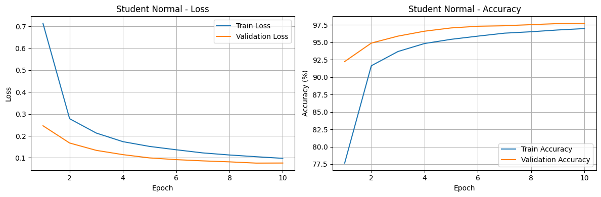
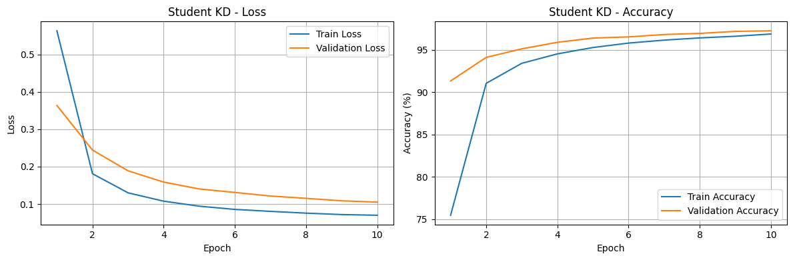
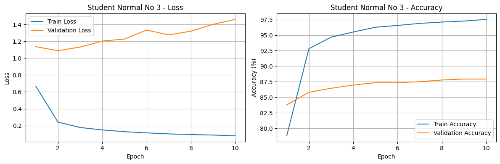
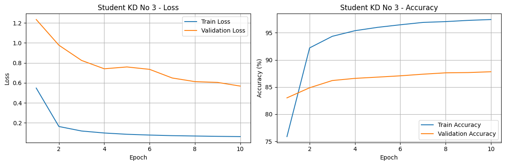
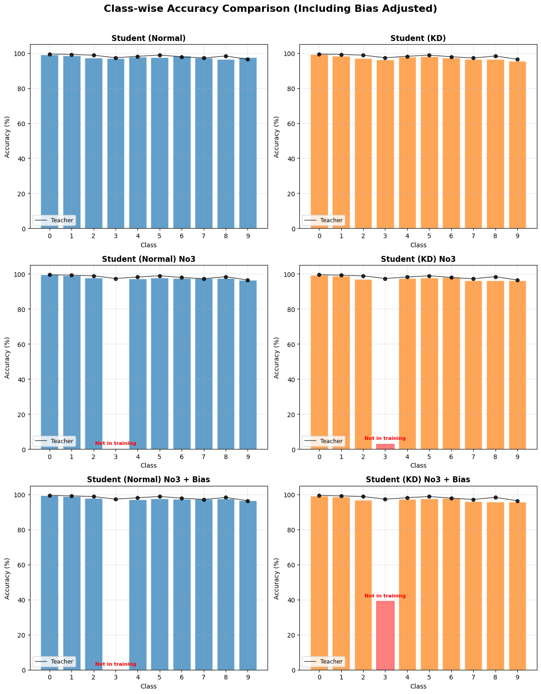

# Introduction

The purpose of this repository is to verify the reproducibility of Knowledge Distillation (KD) on the MNIST dataset as introduced in Geoffrey Hinton's paper, *Distilling the Knowledge in a Neural Network*.

[https://arxiv.org/pdf/1503.02531](https://arxiv.org/pdf/1503.02531)

# Repository Structure

```
Generalization Ability Test for Knowledge Distillation/
├── figures/
├── src/
│   ├── __pycache__/
│   ├── data/
│   │   └── MNIST/
│   │       └── raw/
│   ├── __init__.py
│   ├── data.py
│   ├── main.ipynb
│   ├── models.py
│   └── utils.py
└── README.md
```

# Experiment Design

**Hyperparameters:**

* `temperature=4`
* `alpha=0.9`
* `lr=0.001`
* `epochs=10`
* `dropout=0.5`

**Dataset:**

MNIST dataset with 60,000 training samples and 10,000 test samples.

**Models:**

* **Teacher Model:** A simple MLP with two layers of 1200 nodes each.
* **Student Model:** A simple MLP with two layers of 300 nodes each.

**Control Groups:**

* Student model trained on standard data with a conventional training method.
* Student model trained on standard data using KD.

**Experimental Groups:**

* Student model trained without label `3` using a conventional training method.
* Student model trained without label `3` using KD.

In the experimental groups, the models are trained **without ever seeing label `3`** during training.

Hinton's idea suggests that training with soft targets can improve the *generalization ability* of models. If this hypothesis holds, the KD-trained model in the experimental group should exhibit better prediction accuracy for class `3` than the model trained without KD.

# Training Results
### Control Group


### Experiment Group



Training and validation accuracies show similar trends.

However, looking at the loss curves, the model trained without KD and without label `3` exhibits decreasing training loss while the validation loss increases, indicating **overfitting**.

This suggests that the conventional training method fails to achieve meaningful generalization for the unseen label `3`.

# Result Analysis




In addition to applying KD, Geoffrey Hinton proposed that manually injecting bias values can improve the prediction accuracy for *mythical labels*.

In practice, injecting the proposed bias value of `3.5` from the paper resulted in a **significant accuracy improvement(36.2%p)** of class 3 prediction.

| Class   | Teacher   | Norm      | KD        | Norm No3  | KD No3    | Norm No3+B | KD No3+B  |
| ------- | --------- | --------- | --------- | --------- | --------- | ---------- | --------- |
| 0       | 99.5      | 99.2      | 99.4      | 99.5      | 99.2      | 99.5       | 99.2      |
| 1       | 99.2      | 98.5      | 98.3      | 99.0      | 98.7      | 99.0       | 98.7      |
| 2       | 98.8      | 97.4      | 97.1      | 97.8      | 97.0      | 97.8       | 96.8      |
| 3       | 97.3      | 96.9      | 96.2      | 0.0       | 2.9       | 0.0        | 39.1      |
| 4       | 98.2      | 97.9      | 97.8      | 97.1      | 97.4      | 97.1       | 97.4      |
| 5       | 98.9      | 97.5      | 98.0      | 97.8      | 97.6      | 97.8       | 97.5      |
| 6       | 97.9      | 98.4      | 97.4      | 97.4      | 97.9      | 97.4       | 97.9      |
| 7       | 97.2      | 97.4      | 96.5      | 97.5      | 96.1      | 97.5       | 96.1      |
| 8       | 98.4      | 96.5      | 96.5      | 97.5      | 96.2      | 97.5       | 95.8      |
| 9       | 96.4      | 97.5      | 95.3      | 96.5      | 96.1      | 96.5       | 95.7      |
| **Avg** | **98.18** | **97.72** | **97.25** | **87.01** | **87.91** | **87.01**  | **91.02** |

Notably, the application of manual bias significantly improves the accuracy for class `3` **without substantially sacrificing the accuracy of other classes**, thus increasing the overall accuracy.

# Conclusion

This experiment validates the generalization ability and knowledge transfer benefits of *Knowledge Distillation using soft targets*.

# Future Work

The purpose of this repository was to provide a simplified validation of the experiments proposed in the original KD paper.

As noted by the author, MNIST is relatively simple and has limitations in thoroughly evaluating generalization performance.

Future work will involve:

* Testing on more complex datasets,
* Experimenting with diverse hyperparameter combinations,
* Searching for optimal configurations to enhance the effectiveness of KD on practical tasks.

# Requirements

* `matplotlib`
* `torchvision`
* `torch`
* `tqdm`